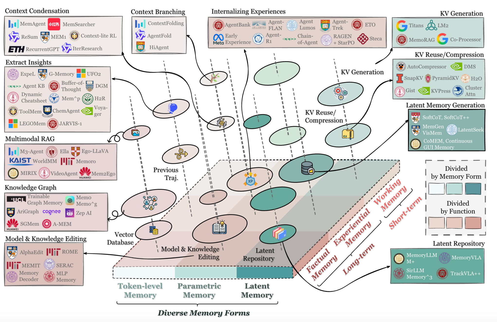
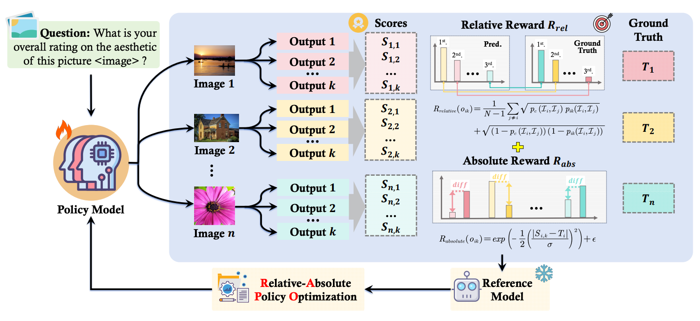
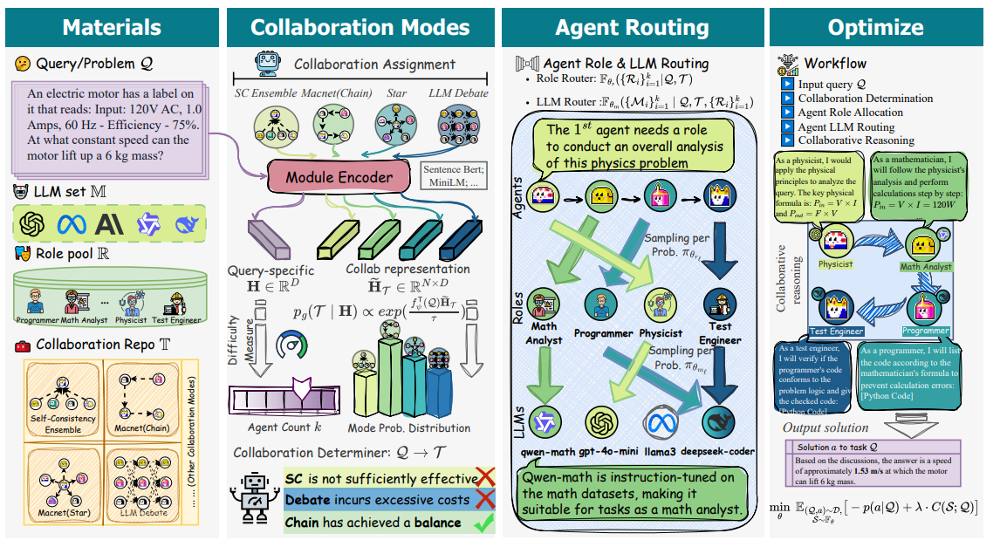

I’m currently a master student at Fudan University at the School of Computer Science of Fudan University. I am a member of [Fudan NLP Lab](https://nlp.fudan.edu.cn/), advised by Prof. [Xuanjing Huang (黄萱菁)](https://xuanjing-huang.github.io/) and Associate Prof. [Tao Gui(桂 韬)](https://guitaowufeng.github.io/). I got my bachelor's degree from Tongji University, advised by Associate Prof. [Dawei Cheng](http://cs1.tongji.edu.cn/~dawei/).

My research interest mainly lies in Multimodal reasoning, LLM Agent, Reinforcement Learning and Efficient AI.

# 🔥 News
- *2026.1*: &nbsp;🎉🎉 Our paper **Unlocking the Essence of Beauty: Advanced Aesthetic Reasoning with Relative-Absolute Policy Optimization**  is accepted by ICLR 2026! See you in Brazil🇧🇷!
- *2025.12*: &nbsp;🎉🎉 Our Agent memory survey  **Memory in the Age of AI Agents** is released on [arXiv](https://arxiv.org/abs/2512.13564)!
- *2025.5*: &nbsp;🎉🎉 Our paper  **Masrouter: Learning to route llms for multi-agent systems** is accepted by ACL 2025 Main!

# 💻 Internships
- **2025.4 - now** Bytedance, Data-Capcut AIGC research  Shanghai, China

# 📝 Selected Publications

Arxiv 2025

### Memory in the Age of AI Agents: A Survey

Yuyang Hu<small>†</small>, Shichun Liu<small>†</small>, Yanwei Yue<small>†</small>, Guibin Zhang<small>†</small>, **Boyang Liu**,etc.
 

- Memory serves as the cornerstone of foundation model-based agents, underpinning their ability to perform long-horizon reasoning, adapt continually, and interact effectively with complex environments. We provide a comprehensive overview through three unified lenses: Forms, Functions, and Dynamics.
-  \|  

ICLR 2026

### Unlocking the Essence of Beauty: Advanced Aesthetic Reasoning with Relative-Absolute Policy Optimization

**Boyang Liu**<small>†</small>, Yifan Hu<small>†</small>, Senjie Jin<small>†</small>, Shihan Dou, Gonglei Shi, Jie Shao, Tao Gui, Xuanjing Huang
 

- We propose **Aes-R1**, a comprehensive aesthetic reasoning framework with reinforcement learning (RL). Concretely, Aes-R1 integrates a pipeline, AesCoT, to construct and filter high-quality chain-of-thought aesthetic reasoning data used for cold-start. After teaching the model to generate structured explanations prior to scoring, we then employ the **Relative-Absolute Policy Optimization (RAPO)**, a novel RL algorithm that jointly optimizes absolute score regression and relative ranking order, improving both per-image accuracy and cross-image preference judgments. Aes-R1 enables MLLMs to generate grounded explanations alongside faithful scores, thereby enhancing aesthetic scoring and reasoning in a unified framework. 
-  \|  

ACL 2025 Main

### Masrouter: Learning to route llms for multi-agent systems

Yanwei Yue<small>†</small>, Guibin Zhang<small>†</small>, **Boyang Liu**<small>†</small>, Guancheng Wan, Kun Wang, Dawei Cheng, Yiyan Qi
 

- We first introduce the problem of **Multi-Agent System Routing(MASR)**, which integrates all components ofMAS into a unified routing framework. Toward this goal, we propose **MasRouter**, the first high-performing, cost-effective, and inductive MASR solution. MasRouter employs collaboration mode determination, role allocation, and LLM routing through a cascaded controller network, progressively constructing a MAS that balances effectiveness and efficiency. 
-  \|  

📖 Experience
- 2021.9 - 2025.6, B.E. at Tongji University with a major in Data Science and Big Data Technology.
